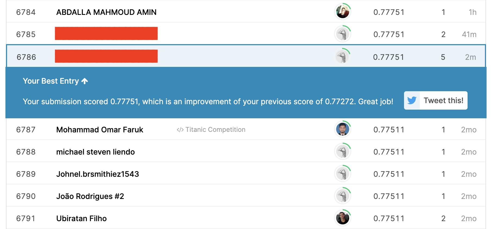

# Kaggle-Titanic

**作品名稱：** Kaggle中Titanic的競賽

**動機：** 該作品為本人在修讀資料科學課程時的作業，因為是參與Kaggle競賽來預測泰坦尼克號的生存，並熟悉機器學習與R語言基礎知識，特別整理於此。

**開發環境：** R語言

**題目解說：** 主要使用機器學習創建一個模型，來預測哪些特徵的乘客，能在泰坦尼克號海難中倖存下來。競賽網站：[Kaggle Titanic](https://www.kaggle.com/c/titanic)

**解題演算法：**
1. 資料預處理，過程中也各種使用分析工具，來有效選擇合適的特徵。
2. 使用SVM作為預測模型(使用多個模型比較後，最後的選擇)。
3. n-fold cross-validation對訓練資料進行交叉驗證，以選擇最佳預測模型。

```R
Rscript HW_Code.R --fold n --train Titanic_Data/train.csv --test Titanic_Data/test.csv --report performance.csv --predict predict.csv
```

**競賽結果：**

